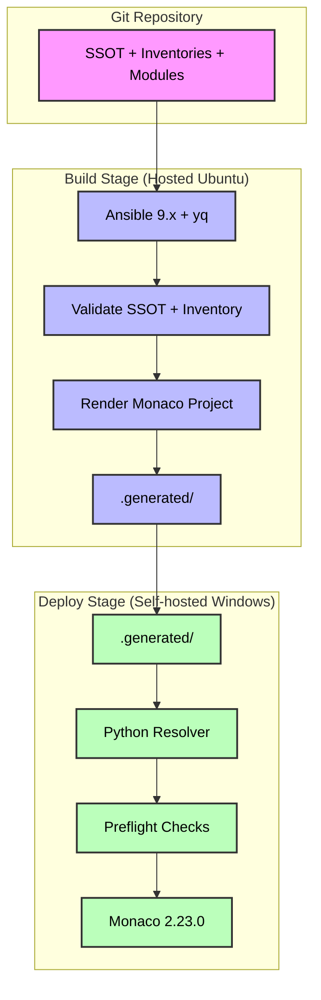

## This is a POC built for a Federal client who wanted to deploy Dynatrace resources using ean excel sheet. This automation takes excel file as the single source of truth and add and remove resources.

# Dynatrace at Scale

> **Goal:** operate large-scale, repeatable Dynatrace configuration for multiple mission spaces/orgs from a **Single Source of Truth (SSOT)**.  
> **Today:** Process Availability (`builtin:processavailability`).  
> **Tomorrow:** tagging, management zones, alerting, dashboards, SLOs, synthetics, app detection rules, etc.

---

## Table of contents

1. [Why this repo](#why-this-repo)  
2. [Architecture](#architecture)  
3. [Repo layout](#repo-layout)  
4. [Quick start (CI/CD)](#quick-start-cicd)  
5. [SSOT & inventory contracts](#ssot--inventory-contracts)  
6. [Pipeline details](#pipeline-details)  
7. [Run it locally](#run-it-locally)  
8. [Extending to more resource types](#extending-to-more-resource-types)  
9. [Security, governance & troubleshooting](#security-governance--troubleshooting)  
10. [Contributing](#contributing) · [Versioning](#versioning) · [License](#license)

## Why this repo

> **Source-of-truth first:** One YAML file per mission space + environment; inventories (JSON/Excel) hold concrete targets.  
> **Separation of concerns:** Modules define how to build Dynatrace configs; SSOT + inventory define what and where.  
> **Build once, deploy many:** Offline render on hosted Ubuntu; promote an immutable artifact to deployment.  
> **Deterministic deploys:** A Python resolver converts human hostnames into exact Dynatrace entity scopes; Monaco applies idempotently with stable externalIds.  
> **Production hygiene:** secret tokens via environment variables only; preflight checks; audit-ready logs.

## Architecture



## Repo layout

```markdown
ansible/
  site.yaml                          # offline render entrypoint
  modules/
    process-availability/            # monaco project template
      config.yaml
      payloads/                      # JSON templates rendered from inventory
envs/
  <org>/
    <env>.yaml                       # SSOT per org/env (url, token var name, inventory pointers)
    process-monitoring.json          # example inventory for process availability
pipelines/
  monaco-deploy.yaml                 # Azure DevOps pipeline
  scripts/
    resolve_host_scopes.py           # Python resolver (entity lookup & scope substitution)
```

## Quick start (CI/CD)

1. Create/verify the self-hosted Windows agent
   - Pool: vibhu_machine (or your pool name)
   - Add a capability on the agent: dynatrace-reach = yes
   - Make sure the agent can reach your Dynatrace URL (Managed/Cluster)

2. Add pipeline secret variable(s)
   - For each environment referenced in SSOT:
   - Create a secret variable matching the SSOT token var (e.g., DT_TOKEN_CRA_PROD)
   - Do not commit tokens; they are consumed from the agent's environment only

3. Configure SSOT + Inventory
   - SSOT file path: envs/<org>/<env>.yaml (see examples below)
   - Inventory path is referenced from SSOT (JSON or Excel; JSON shown below)

4. Run the pipeline
   - Pipeline file: pipelines/monaco-deploy.yaml
   - Parameters:
     * mission_space: e.g. cra
     * environment: dev or prod
     * run_mode: plan, dry-run, or apply

## SSOT & inventory contracts

### SSOT (envs/<org>/<env>.yaml)

```yaml
# minimal example
env: prod
url: "https://<your-managed-or-saas>/e/<env-id>"   # base API URL
token_var: "DT_TOKEN_CRA_PROD"                     # name of secret env var on agent
resources:
  process_monitoring_inventory: "envs/cra/process-monitoring.json"
```

### Inventory (JSON) for Process Availability

```json
[
  {
    "externalId": "cra-prod-procavail-smpolicysrv-ec01ld4551-00-isvcs-net",
    "name": "cra-prod-procavail-smpolicysrv-ec01ld4551-00.isvcs.net",
    "xHostName": "ec01ld4551-00.isvcs.net",        // required for resolver
    "operatingSystem": ["LINUX"],
    "minimumProcesses": 1,
    "rules": [
      { "ruleType": "RuleTypeProcess", "property": "executable", "condition": "$eq(smpolicysrv)" }
    ],
    "metadata": [
      { "metadataKey": "Event-Category",  "metadataValue": "APP" },
      { "metadataKey": "Event-Recipient", "metadataValue": "SL-EMAIL" }
    ]
  }
]
```

> **Important:** xHostName is a helper field used by the resolver (not a Dynatrace schema property).
> The resolver removes it before deploy and sets the final "scope": "HOST-<ENTITY-ID>".
> If xHostName is missing, the pipeline will fail fast with a clear message.

## Pipeline details

### Stages

1. BuildManifest (hosted Ubuntu)
   - Installs Ansible 9.x + yq
   - Validates SSOT + inventory path
   - Renders Monaco project & payloads offline
   - Publishes .generated artifact

2. Deploy (self-hosted Windows)
   - Downloads .generated
   - Resolve HOST scopes (Python) — pipelines/scripts/resolve_host_scopes.py:
     * calls /api/v2/entities?entitySelector=type(HOST),entityName("<host>")&pageSize=10
     * writes back "scope": "HOST-..." and deletes xHostName
     * fails if lookup returns 0 results
   - Preflight — checks /api/v1/time and /api/v1/config/clusterversion
   - Monaco 2.23.0 — plan / --dry-run / apply
   - stable externalIds for traceability
   - logs to .logs/<timestamp>-*.log

### Agent demands

```yaml
pool:
  name: vibhu_machine
  demands:
  - dynatrace-reach -equals yes
```

## Run it locally

1. Offline render (Linux/macOS/WSL)
   ```bash
python3 -m pip install --upgrade pip "ansible==9.*" pyyaml
ansible-playbook -i localhost, -c local ansible/site.yaml \
  -e ansible_connection=local \
  -e ssot_file=envs/<org>/<env>.yaml \
  -e env_file=envs/<org>/<env>.yaml \
  -e lookup_hosts=false
```

2. Resolve scopes (Windows/macOS/Linux)
   ```bash
python pipelines/scripts/resolve_host_scopes.py \
  --generated .generated \
  --env prod \
  --base-url "https://<your-managed-or-saas>/e/<env-id>" \
  --token-env DT_TOKEN_CRA_PROD
```

3. Deploy with Monaco
   ```bash
# Windows: download monaco-windows-amd64.exe (2.23.0)
monaco.exe deploy .generated/manifest.yaml -e prod -v
# Dry-run:
monaco.exe deploy .generated/manifest.yaml -e prod -v --dry-run
```

## Extending to more resource types

Create a module under ansible/modules/<new-module>/ with:

1. config.yaml describing Monaco project + schema
2. payloads/ Jinja/JSON templates
3. Add inventory for that resource (JSON/Excel). Use helper fields for resolution:
   - e.g., xServiceName, xProcessGroupId, xManagementZone, etc.
4. Update the resolver (if the resource needs entity resolution):
   - generalize resolve_host_scopes.py or add resolve_entities.py with a pluggable strategy per schema
5. Reference the inventory from SSOT (new resources.* key)
6. Render & deploy via the same pipeline. The build is still offline; only the resolver + Monaco talk to Dynatrace.

## Security, governance & troubleshooting

### Security

> **Tokens:** read from secret variables on the agent, never from the repo.
> The resolver passes tokens in-memory; no token is written to disk.
> Remove HTTPS_PROXY/HTTP_PROXY only for Monaco if your preflight uses direct access.

### Governance

> **Run modes:**
> - plan → build only (safe for PR)
> - dry-run → full pipeline without writes
> - apply → requires approval
> **Auditability:**
> - logs in .logs/ (Monaco)
> - artifact .generated/ is immutable input to deploy
> - externalId maps portal objects back to repo paths

### Troubleshooting

| Symptom | Likely cause | Fix |
| --- | --- | --- |
| Dynatrace token env var '...' is not available | Secret var not set on agent | Add the variable with the exact name from SSOT (token_var) |
| Inventory file missing | SSOT